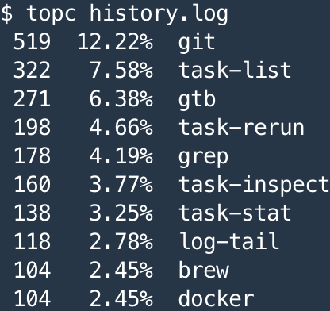

# Demo CLI topc

本演示通过实现一个名为 topc 的自定义命令，来展示如何在真实环境中使用之前所学的各种 CLI 基础知识。

同时，也会展示通用的分析问题、解决问题的不同思路，供大家参考、学习。

在现实世界中当我们去满足真实的用户需求时，需要我们在权衡各种限制条件（约束）后做出最终的平衡，答案往往不是 0 或 1 这种简单的二选一，总是需要在 0 和 1 之间的找到某个平衡的位置，而且随着条件的变化，答案的位置也会随之变化，不会有永远的最佳答案或正确答案。

我们会去追求“完美”，但达到“完美”一定是基于当前情况的各种妥协，寻找最佳的平衡而已。

所以，大家在解决实际问题的过程中，务必了解这一点：平衡。不要无谓的钻牛角尖，浪费自己宝贵的时间，还有，宝贵的头发。

最后，现实世界中处理问题同样也有数不清的细节要考虑，这里在 demo 中会做适当的忽略，有些忽略会表述出来，有些忽略可能没有显示的说明。希望不要对大家造成不必要的困扰。

任何疑问、困惑或者建，都欢迎大家随时群聊、私聊进行讨论。

## 需求描述

这里我们要实现一个用户自定义命令（command）：`topc` 。

当用户执行该命令时，需要通过参数提供一个包含历史命令的文件，如：

```shell
topc history.log
```

本 demo 提供了供测试的样例文件：`history.log`，可以在当前目录下找到，内容如以下代码片段所示：

```shell
head history.log
exit
ll
git
sudo snap install shell2http
shell2http -cgi /cat "cat /tmp/abc.txt" POST:/top "cat | jq . >> /tmp/abc.txt; echo >> /tmp/abc.txt; echo Ok"
telnet -nltp
netstat -nltp
nohup shell2http -cgi /cat "cat /tmp/abc.txt" POST:/top "cat | jq . >> /tmp/abc.txt; echo >> /tmp/abc.txt; echo Ok" &
ll
cat nohup.out
```

`topc` 命令将会对文件内容进行分析，统计每个命令出现的次数，最终输出 Top 排行榜，列出使用次数最多的十个命令。



文本形式的的输出结果保存在 `output.txt` 中，可以在 Ubunut 里执行以下命令快速验证结果是否与 `output.txt` 相符：

```txt
diff ./output.txt <(topc history.log)
```

请将所有实现代码写在 `topc` 文件中，无需创建其它文件或 shell functions 等。

参考答案在 `.topc` 中，请自行按需选择如何使用 :)

### 具体要求

* 按次数从多到少进行排列，次数一样的，按照字母升序排列
* 文件不存在时要给出适当的提示信息（stderr、non-zero exit code）
* 如果命令里出现了管道的使用，需要将管道里的每个命令都要统计次数，不能只统计第一个命令而忽略后面的命令
* 如果命令行的第一个单词是以下命令，则忽略之，取其后面的命令进行计数
  * sudo
  * nohup
* 如果命令以相对路径或绝对路径的方式出现，需去掉路径部分，只取命令名字本身进行计数，如：
  * scripts/task-list -> task-list
  * /scripts/task-list -> task-list
  * ./scripts/task-list -> task-list
* 忽略以下极其常见且简单的命令
  * ls
  * ll
  * cd
  * echo
  * cat
  * vim
* 某些命令行的可能存在一个或多个前置的空格，需要忽略掉这些空格再进行计数
* 可以只针对所提供示例文件进行编写，不必考虑更多复杂情况（`$(... $(...))`）

## 我应该学到什么

* 如何将一个复杂问题逐步的化繁为简地解决掉
  * 务必要自己实际多做几次，光看的话，一定会觉得“很乱”
* 一些实用命令的用法：sort、uniq、grep、cut、sed、awk 等等
* 一些 Shell 脚本的技巧
  * 参数检查
    * `declare -r INPUT_FILE="${1:?input file is required!}"`
  * Process substitution
    * `diff ./output.txt <(topc history.log)`
    * `topc <(history | tr -s ' ' | cut -d' ' -f3-)`
  * 快速调试
* 如何执行自定义的命令
  * 关于 `$PATH` 环境变量
  * 关于 Linux 的目录结构的简单了解
    * [General overview of the Linux file system](https://tldp.org/LDP/intro-linux/html/sect_03_01.html)
    * [Linux目录结构](http://linux-wiki.cn/wiki/zh-hans/Linux%E7%9B%AE%E5%BD%95%E7%BB%93%E6%9E%84)
* 管道的思想
* 数据的处理和数据的展示要分离
* 自己要负责代码的正确性
  * 自己要想办法进行验证
  * 要考虑周全
  * 这不是一件容易的事情
  * 关乎职业操守、职业道德
* 耐心。当然，搞定各种问题，也正是编程的乐趣所在

## 写在最后

请大家不必为不知道某些命令而焦虑，学习 CLI 是个漫长的过程，不急，慢慢来。

当前 step 的目的绝不是让大家立刻就要变成一个 CLI 高手。

我们只要通过对相应的学习资料、homework 以及 assignment 的学习，掌握足够的基础知识，让我们之后能不在跟 CLI 相关的内容上浪费无谓的时间即可。

所以，我们建议大家：

掌握 homework 及 assignment 所覆盖的内容就行，以后再慢慢学习其它更多内容。

